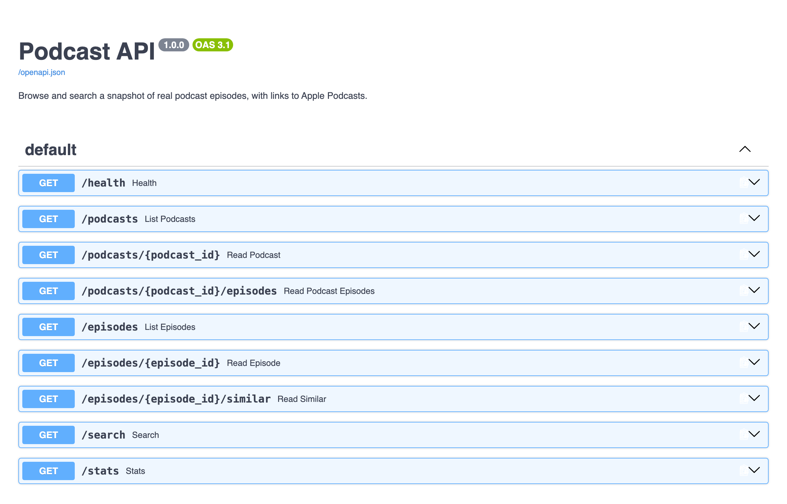

# CI-recall

Record every GitHub Actions run, search past failures by meaning, and ask questions about your pipeline.

> 🚧 Work in progress. This repo currently contains the demo app and its CI pipeline. The pipeline history collector and the CI Recall dashboard are coming next.

## Demo app: Podcast API

A small FastAPI service that the pipeline builds, tests and deploys. Browse and search recent episodes from 8 real podcasts, each with a link to Apple Podcasts.



### Data

`app/data/` holds a snapshot of public podcast metadata (podcast and episode names, durations, release dates and Apple Podcasts links) fetched from Apple's [iTunes Search API](https://performance-partners.apple.com/search-api). No descriptions or audio are stored. Podcast names and episode titles belong to their publishers.

Tests use a fixed copy in `tests/fixtures/`, so changes to the data don't break them.

### Run locally

```bash
python3 -m venv .venv
source .venv/bin/activate
pip install -r requirements.txt -r requirements-dev.txt
uvicorn app.main:app --reload
```

Open http://127.0.0.1:8000/docs for the interactive API docs.

### Test

```bash
pytest -v
ruff check . && ruff format --check .
```

## CI pipeline

`.github/workflows/ci.yml` runs on every push: **lint → test → build image → deploy** (deploy only on `main`, pushing to `ghcr.io/cyrilbaah/ci-recall` and recording a `production` deployment).
